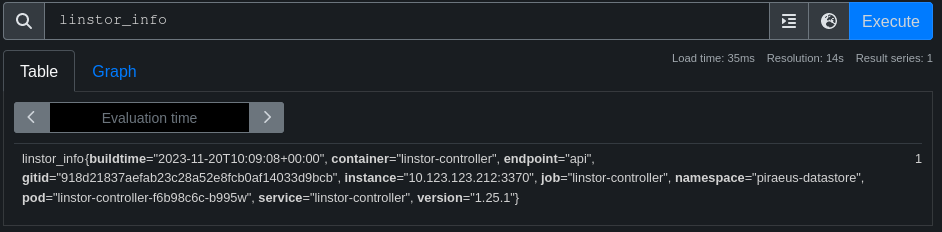
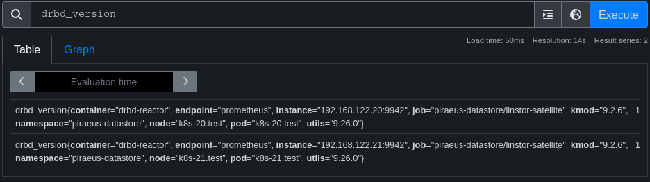
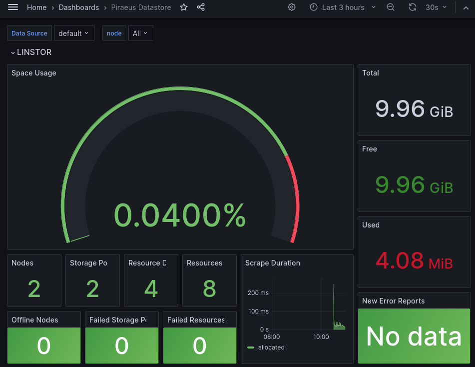

# How to Deploy Monitoring with Prometheus Operator

Piraeus Datastore offers integration with the [Prometheus monitoring stack].

The integration configures:

* Metrics scraping for the LINSTOR and DRBD state.
* Alerts based on the cluster state
* A Grafana dashboard

To complete this guide, you should be familiar with:

* Deploying workloads in Kubernetes using [`helm`](https://helm.sh/)
* Deploying resources using [`kubectl`](https://kubernetes.io/docs/tasks/tools/)

## Deploying Prometheus Operator

> 🗒️ NOTE: If you already have a working Prometheus Operator deployment, skip this step.

First deploy the [Prometheus Operator](https://prometheus-operator.dev/). A simple way to deploy it, is to use the helm
chart provided by the Prometheus Community.

First, add the helm chart repository to your local helm configuration:

```
$ helm repo add prometheus-community https://prometheus-community.github.io/helm-charts
```

Then, deploy the [`kube-prometheus-stack`](https://artifacthub.io/packages/helm/prometheus-community/kube-prometheus-stack) chart.
This chart will set up Prometheus, AlertManager and Grafana for your cluster. Configure it to search for monitoring and
alerting rules in all namespaces:

```
$ helm install --create-namespace -n monitoring prometheus prometheus-community/kube-prometheus-stack \
  --set prometheus.prometheusSpec.serviceMonitorSelectorNilUsesHelmValues=false \
  --set prometheus.prometheusSpec.podMonitorSelectorNilUsesHelmValues=false \
  --set prometheus.prometheusSpec.ruleSelectorNilUsesHelmValues=false
```

> 🗒️ NOTE: By default, the deployment will only monitor resources in the `kube-system` and its own namespace. Piraeus
> Datastore is usually deployed in a different namespace, so Prometheus needs to be configured to watch this namespace.
> In the example above, this is achieved by setting the various `*NilUsesHelmValues` parameters to `false`.

## Deploying Monitoring and Alerting Rules for Piraeus Datastore

After creating a Prometheus Operator deployment and configuring it to watch all namespaces, apply the monitoring
and alerting resources for Piraeus Datastore:

```
$ kubectl apply --server-side -n piraeus-datastore -k "https://github.com/piraeusdatastore/piraeus-operator//config/extras/monitoring?ref=v2"
```

## Verify Monitoring

Verify that the monitoring configuration is working by checking the prometheus console. First, get access to the
prometheus console from your local browser by forwarding it to local port 9090:

```
$ kubectl port-forward -n monitoring services/prometheus-kube-prometheus-prometheus 9090:9090
```

Now, open http://localhost:9090/graph and display the `linstor_info` and `drbd_version` metrics:




To view the dashboard, forward the grafana service to local port 3000:

```
$ kubectl port-forward -n monitoring services/prometheus-grafana 3000:http-web
```

Now, open http://localhost:3000 and log in. If using the example deployment from above, use username `admin` and
password `prom-operator` to gain access. Then, select "Piraeus Datastore" from the available dashboards:



[Prometheus monitoring stack]: https://github.com/prometheus-operator/kube-prometheus
