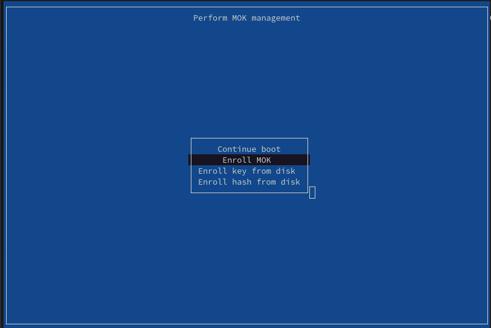
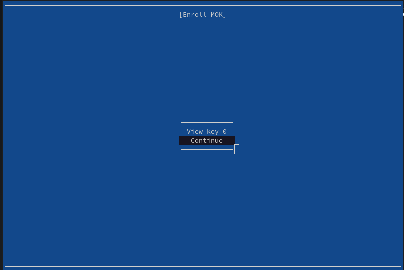
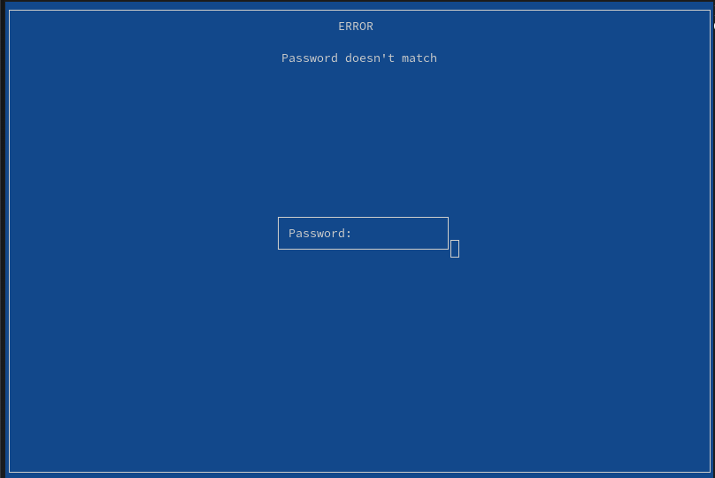
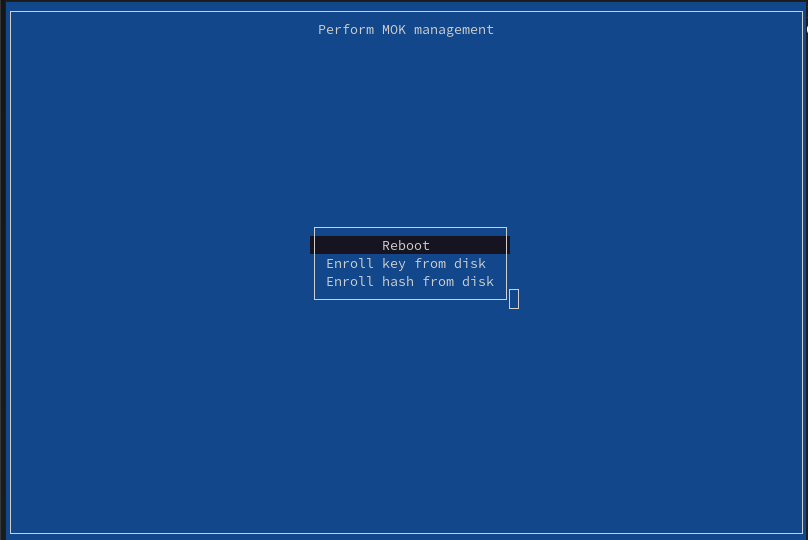

# How to Load DRBD with SecureBoot Enabled

This guide shows you how to use the DRBD® Module Loader on machines with SecureBoot enabled.

When SecureBoot is enabled the Linux Kernel refuses to load unsigned kernel modules. Since the DRBD modules are built
from source, they do not have a valid signature by default. To load them, they need to be signed, and the signing key
needs to be inserted into the machine's trust store.

To complete this guide, you should be familiar with:

* editing `LinstorSatelliteConfiguration` resources.
* generating key material with `openssl`.
* managing machine owner keys with `mokutil`.
* creating and protecting Kubernetes Secret resources.

## Prerequisites

* A Kubernetes node running with SecureBoot enabled. This can be checked by running the following command on each node:
  ```
  # mokutil --sb-state
  SecureBoot enabled
  ```
* Console access to the machine during early boot, or permissions to update the EFI platform keys another way.

## Generate Key Material

Create a private key and self-signed certificate using the `openssl` command line utility. The following command will
create a new private key named `signing_key.pem` and a certificate named `signing_key.x509`, valid for 10 years, in the
appropriate format:

```
$ openssl req -x509 -new -nodes -utf8 -sha256 -days 36500 -batch -outform DER \
    -out signing_key.x509 -keyout signing_key.pem -config - <<EOF
[ req ]
default_bits = 4096
distinguished_name = req_distinguished_name
prompt = no
string_mask = utf8only
x509_extensions = myexts

[ req_distinguished_name ]
O = Piraeus Datastore
CN = Piraeus Datastore kernel module signing key
emailAddress = piraeus-signing-key@example.com

[ myexts ]
basicConstraints=critical,CA:FALSE
keyUsage=digitalSignature
subjectKeyIdentifier=hash
authorityKeyIdentifier=keyid
EOF
```

## Enroll the Certificate in the Machine Trust Store

The generated certificate needs to be added to the machine's trust store. This step depends on the machine platform you
are using. The instructions here apply to any system where you have console access during early boot, such as bare-metal
or most virtualization platforms.

First, distribute the generated certificate `signing_key.x509` to all nodes. Then, use the following command to add the
certificate to the machine owner keys (MOK) using a password of your choice:

```
# mokutil --import signing_key.x509
input password:
input password again:
```

To enable the keys, start a console session on the machine, either by directly attching a keyboard and monitor,
attaching a virtual console using the machines BMC, or using tools of your virtualization platform such as virt-viewer
or VNC.

Then, reboot the machine, chosing to "Perform MOK management" when promted. Now:
* Select "Enroll MOK":

  
* Continue enrollment of the key:

  
* Enter the password chosen when running `mokutil --import`:

  
* Reboot the machine:

  

## Sign the DRBD Module Using the Created Key Material

Create a Kubernetes Secret resource containing the generated key material. The following command creates a secret named
`drbd-signing-keys`:

```
$ kubectl create secret generic drbd-signing-keys --type piraeus.io/signing-key \
    --from-file=signing_key.pem --from-file=signing_key.x509
secret/drbd-signing-keys created
```

Now, configure the `drbd-module-loader` to use the key material to sign the kernel modules. The following
`LinstorSatelliteConfiguration` resource makes the key available in the `drbd-module-loader` container available and
sets the `LB_SIGN` environment variable to start signing the modules:

```yaml
apiVersion: piraeus.io/v1
kind: LinstorSatelliteConfiguration
metadata:
  name: drbd-module-signing
spec:
  podTemplate:
    spec:
      initContainers:
      - name: drbd-module-loader
        env:
        - name: LB_SIGN
          value: /signing-key
        volumeMounts:
        - name: signing-key
          mountPath: /signing-key
          readOnly: true
      volumes:
      - name: signing-key
        secret:
          secretName: drbd-signing-keys
```

## Verifying Success

When everything is configured correctly, the `drbd-module-loader` init container will be able to insert the DRBD
modules.

```
$ kubectl logs ds/linstor-satellite.node1.example.com drbd-module-loader
...
DRBD version loaded:
version: 9.2.8 (api:2/proto:86-122)
GIT-hash: e163b05a76254c0f51f999970e861d72bb16409a build by @linstor-satellite.k8s-21.test-zskzl, 2024-04-03 09:04:15
Transports (api:20): tcp (9.2.8) lb-tcp (9.2.8) rdma (9.2.8)
```

If the modules are not signed, or the signature is not trusted, the `drbd-module-loader` container will crash with one
of the following error messages:

```
insmod: ERROR: could not insert module ./drbd.ko: Operation not permitted
insmod: ERROR: could not insert module ./drbd_transport_tcp.ko: Operation not permitted
insmod: ERROR: could not insert module ./drbd_transport_lb-tcp.ko: Operation not permitted

Could not load DRBD kernel modules
```

```
insmod: ERROR: could not insert module ./drbd.ko: Key was rejected by service
insmod: ERROR: could not insert module ./drbd_transport_tcp.ko: Key was rejected by service
insmod: ERROR: could not insert module ./drbd_transport_lb-tcp.ko: Key was rejected by service

Could not load DRBD kernel modules
```

```
insmod: ERROR: could not insert module ./drbd.ko: Required key not available
insmod: ERROR: could not insert module ./drbd_transport_tcp.ko: Required key not available
insmod: ERROR: could not insert module ./drbd_transport_lb-tcp.ko: Required key not available

Could not load DRBD kernel modules
```

Additional information is available in the kernel logs:

```
$ dmesg
...
# The module is not signed. Check that the LB_SIGN environment variable is set in the container.
Lockdown: insmod: unsigned module loading is restricted; see man kernel_lockdown.7
# The module is signed, but the signing key is not in the machine's trust store.
# Check the enrolled keys using "mokutil --list-enrolled".
PKCS#7 signature not signed with a trusted key
```
